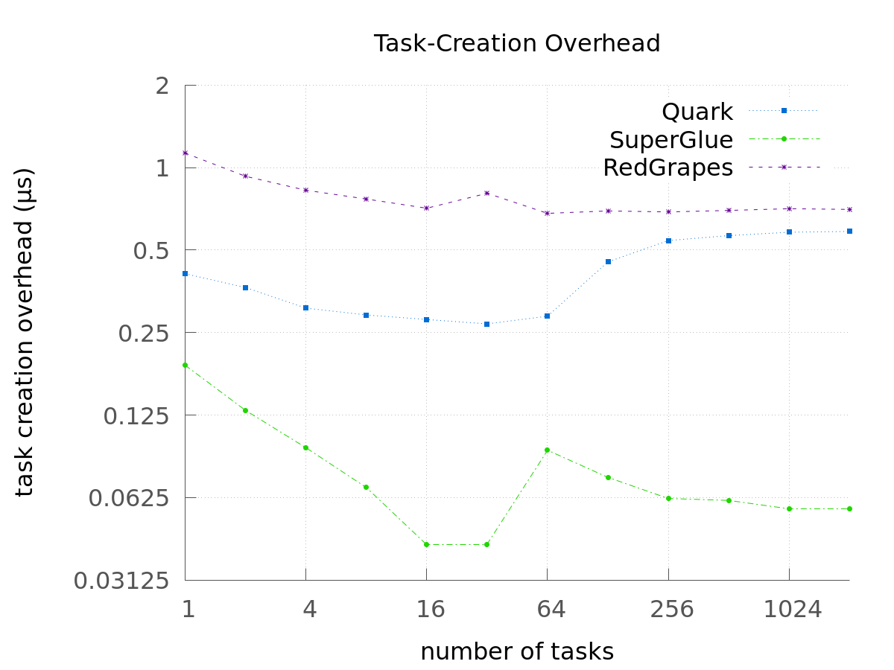
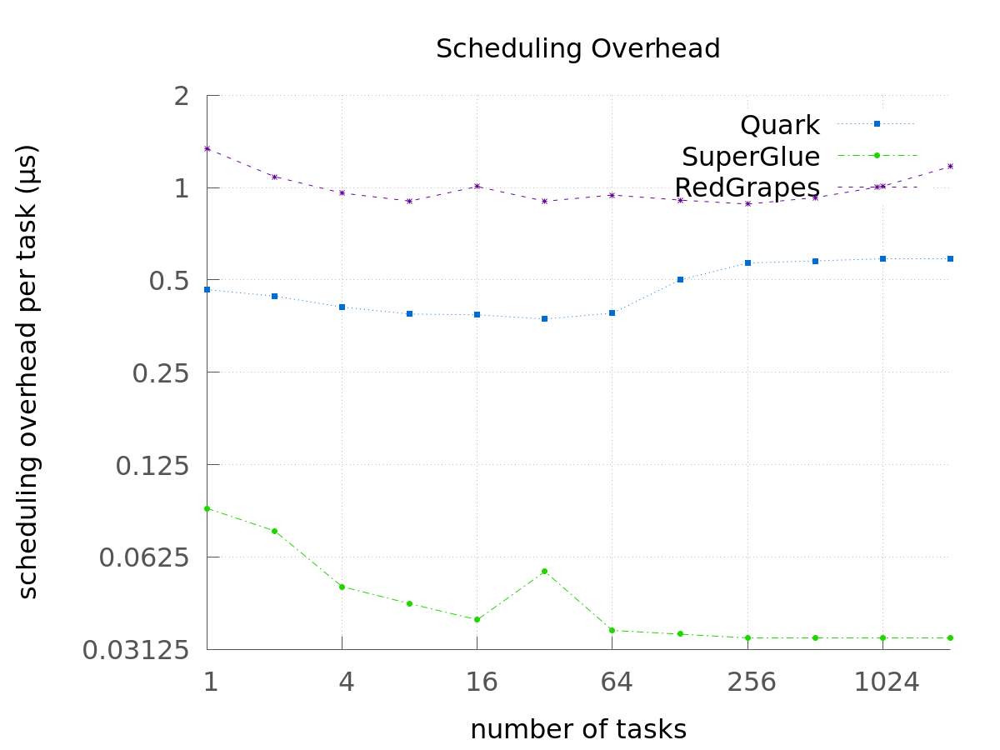
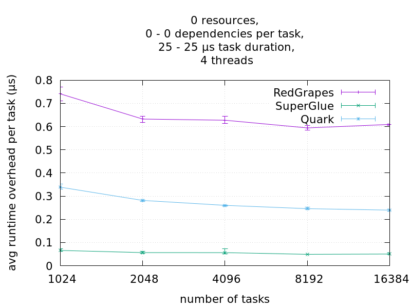
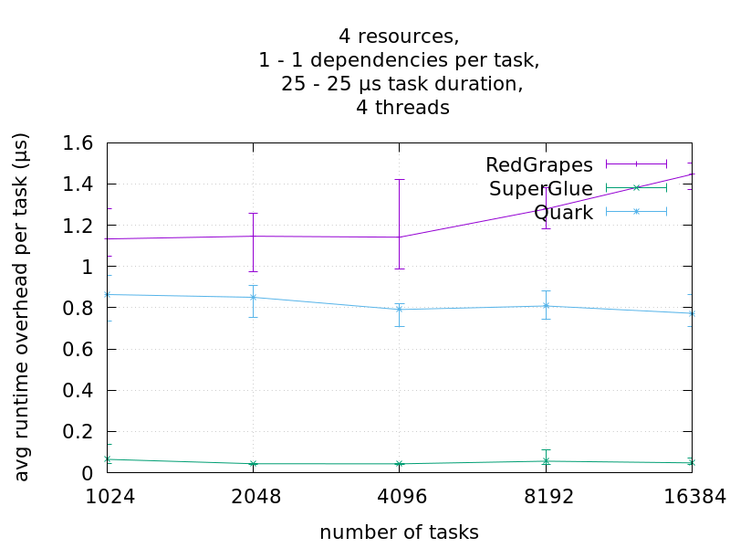
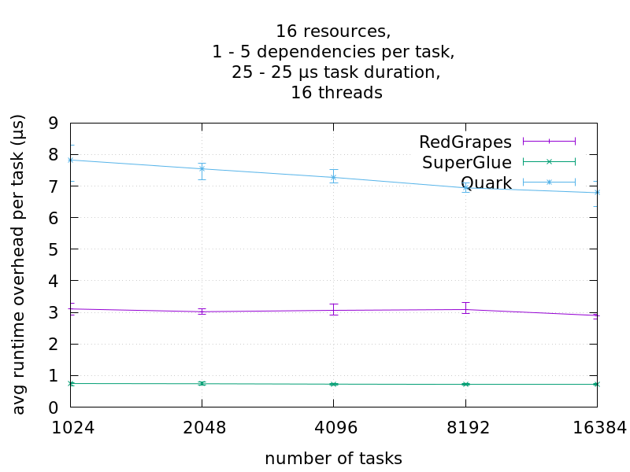
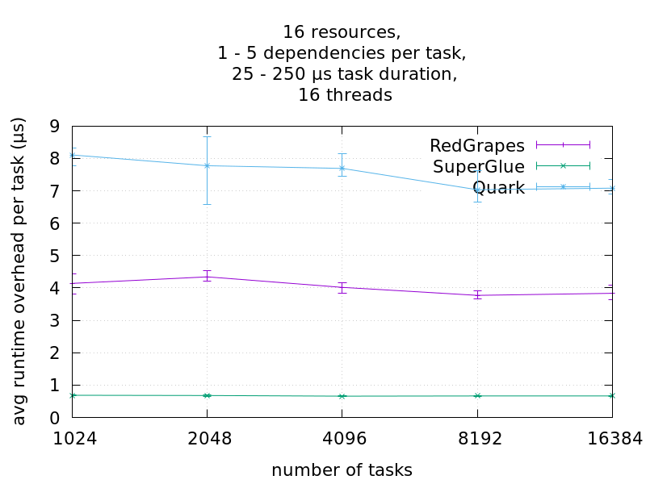
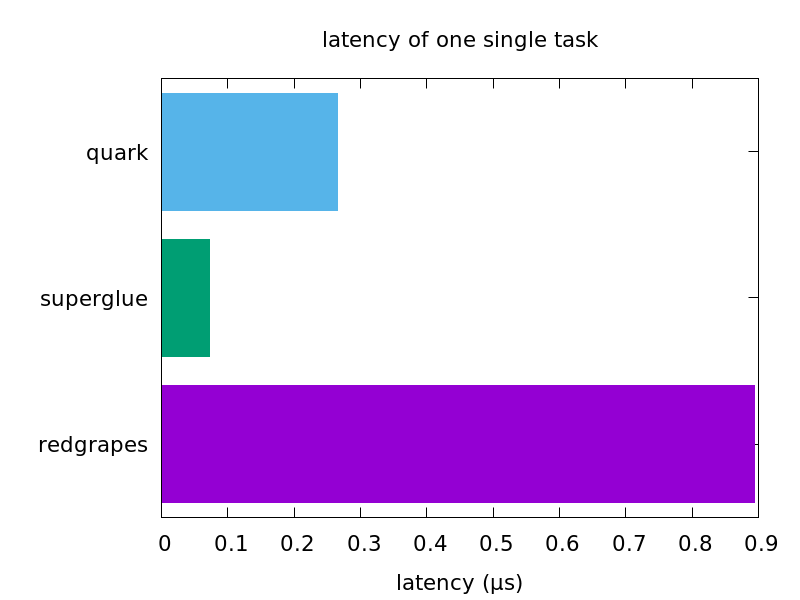
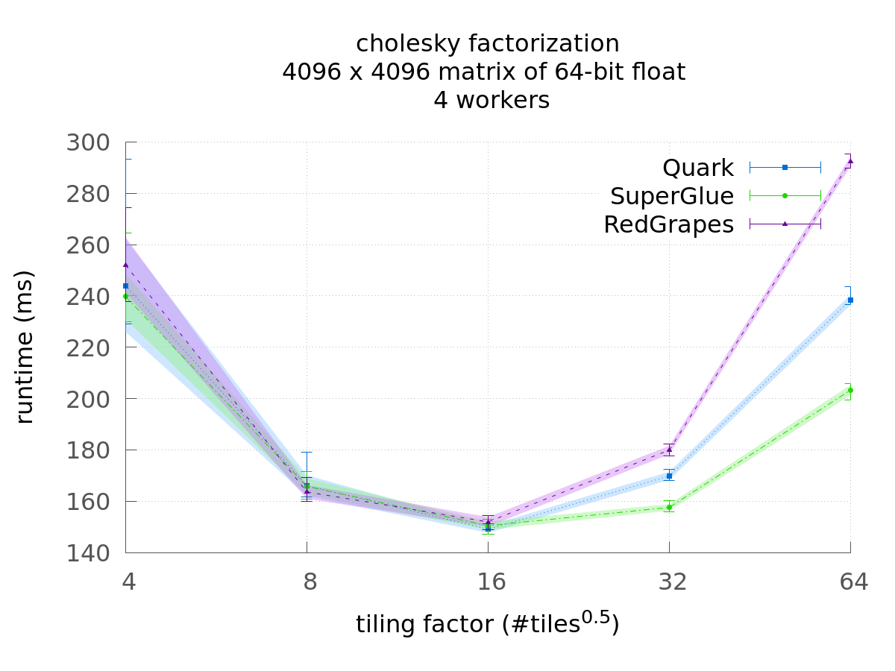

# Tasklib Benchmark
All measurements were done using an AMD Epyc 7702 with 64 cores at 2.0 GHz and 512 GB of RAM. As compiler, we used gcc 11.2.0 with the -O3 option.

## Overhead

### Task Creation Overhead
First, we measure the average time it takes to submit a task to the runtime system.
All Tasks have exactly one dependency.

### Scheduling Overhead
Then after all tasks are created, we measure the time it takes for the runtime system to consume all tasks.
Since the tasks have an empty function-body, the overhead required for the scheduling is left.
Only a single worker is used.

### Total Runtime Overhead
In this benchmark, we spawn a number of tasks, where each task sleeps for a fixed duration of 25μs.
Task dependencies, if any, are generated randomly.
The resulting order of task execution is verified by calculating in each task the sha256 hash of each resource thatthis task touches and adding the task-id. So the final value of each resource is dependent on the execution order of the tasks. The expected results are pre-calculated sequentially and verified at the end.
As performance metric we measure the runtime overhead, given by the difference between the measured and ideal execution time.
The ideal execution time is the sum of task durations along the critical path.
Then the runtime overhead is divided by the number of tasks to give an average per-task measure.

#### Independent Tasks
In this case, all tasks are independent, i.e. they do not use any resources, so they could be executed in parallel and in any order. The ideal execution time is then given by $$ n\_tasks * task\_duration / n\_workers $$.
We measure the total execution time and take the difference to the ideal execution time and divide by the number of tasks. This yields the average overhead per task.
Now multiple workers (4) are used.

### Chains
Here we create tasks with exactly one dependency each. This is done by having as many resources as workers (4 in this case) and randomly choosing a resource for each task.

### Random Graph
Now, for each task, the number of dependencies it has is randomly distributed, where each task has at least one dependency and at maximum five. Then, for each required dependency a unique resource is chosen which the task uses.
Since the number of workers and thus the actual amount parallelism is finite, we must be careful not to introduce potential parallelism that exceeds our practical capabilities. Otherwise, the unrealistically short critical paths would create a falsely high ovearhead measure.
Therefore the number of resources is equal to the number of workers, to limit potential parallelism.

## Latency
This Benchmark measures the latency of creating a single task.
Latency is the time elapsed between the emplacement of a task and the begin of its execution.
Since this metric is only useful if we assume no dependencies of the task, and that the task is scheduled immediately, we measure latency only on single tasks without dependencies.

## Cholesky Factorization
As a more practical example, we calculate a *tiled* cholesky decomposition using BLAS functions on a randomly generated, 1GiB sized matrix and measure the total runtime.

