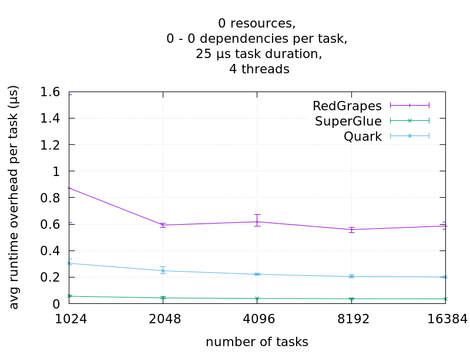
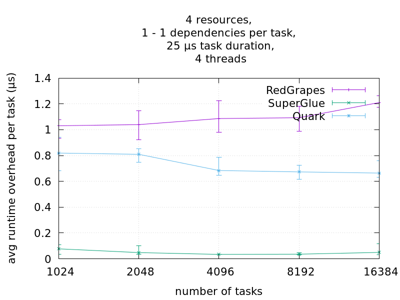
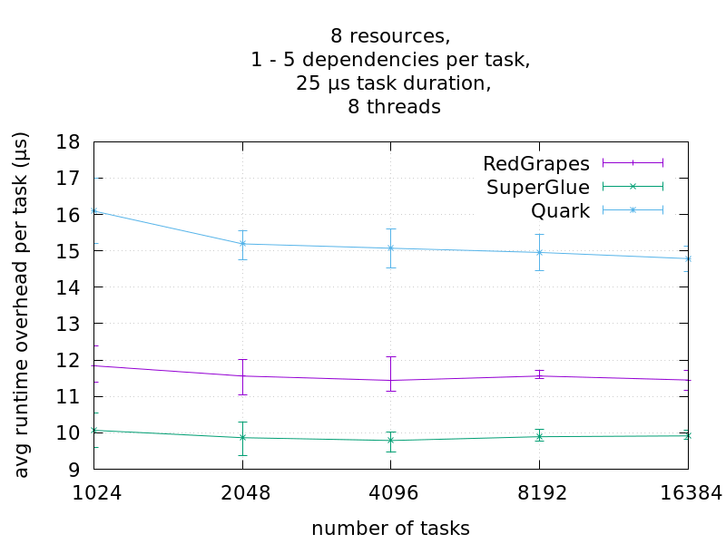
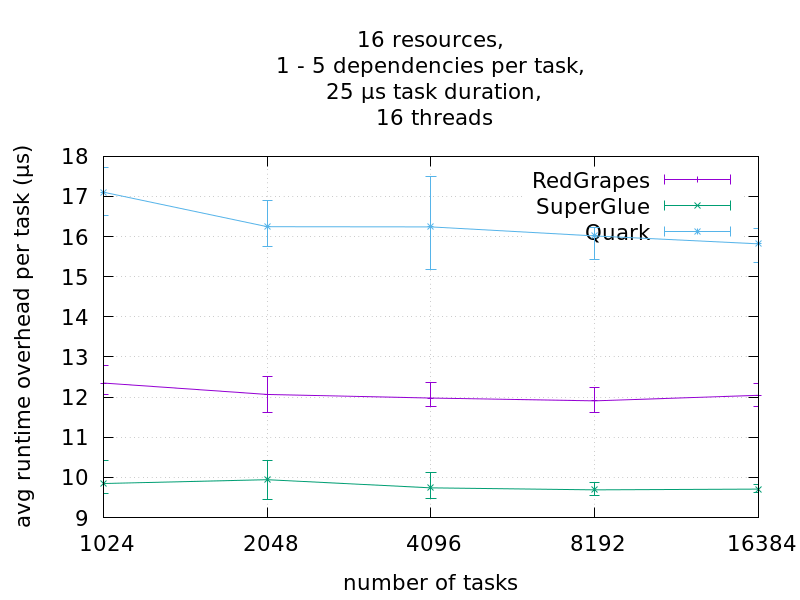
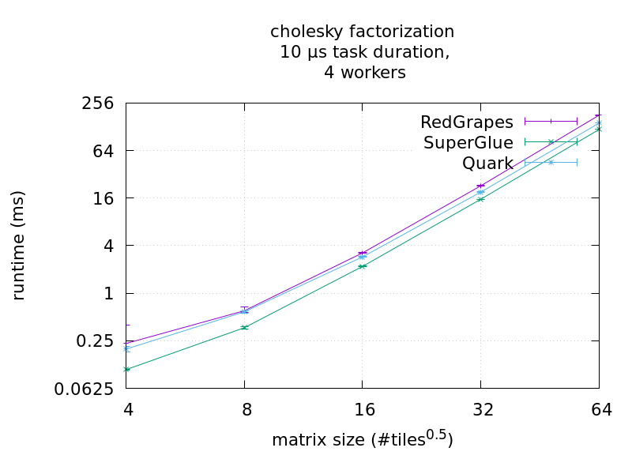

# Tasklib Benchmark

## Latency
This Benchmark measures the latency of creating a single task.
Latency is the time elapsed between the emplacement of a task and the begin of its execution.
Since this metric is only useful if we assume no dependencies of the task, and that the task is scheduled immediately, we measure latency only on single tasks without dependencies.

## Overhead

### Task Creation Overhead
task creation time

### Scheduling Overhead
chain of empty tasks

### Total Runtime Overhead

#### Independent Tasks
In this benchmark, we spawn a number of tasks, where each task sleeps for a fixed duration.
All tasks are independent, i.e. they do not use any resources, so they could be executed in parallel and in any order. The ideal execution time is then given by $ n_tasks * task_duration / n_workers $.
We measure the total execution time and take the difference to the ideal execution time and divide by the number of tasks. This yields the average overhead per task.

### Chains

### Random Graph

* fixed task duration (25μs)
* verification of correct execution order using sha256 hashes

## Cholesky Factorization

We create the task-graph required for computing a *tiled* cholesky decomposition using BLAS functions and measure the total runtime. However instead of doing the actual computations, we use a sleep of 10μs. (todo why)

